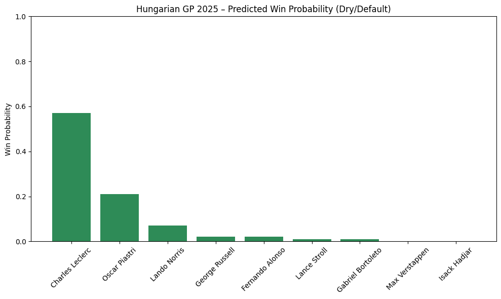
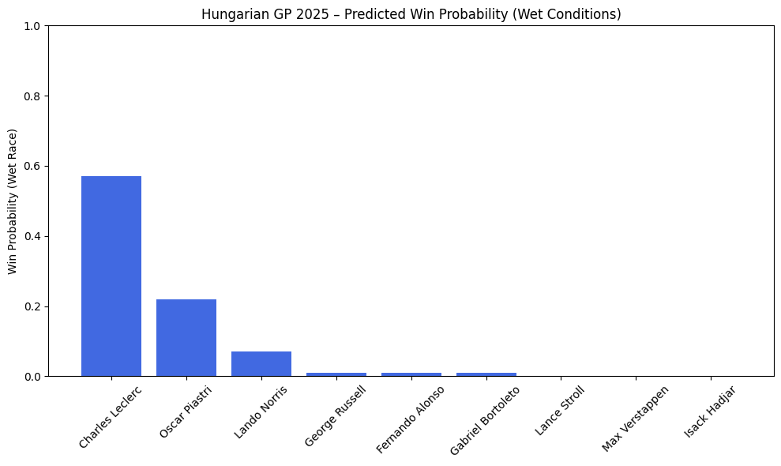
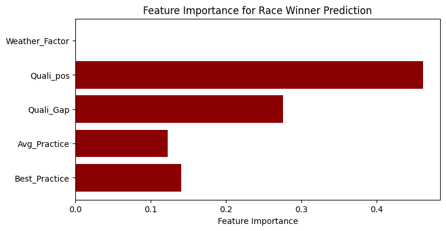

```python
import pandas as pd
import matplotlib.pyplot as plt
from sklearn.ensemble import RandomForestClassifier
import numpy as np
```


```python
wet_specialists = {
    'Charles Leclerc': 0,
    'Oscar Piastri': 0,
    'Lando Norris': 1,
    'George Russell': 1,
    'Fernando Alonso': 1,
    'Lance Stroll': 0,
    'Gabriel Bortoleto': 0,
    'Max Verstappen': 1,
    'Liam Lawson': 0,
    'Isack Hadjar': 0
}

data = {
    'Driver': [
        'Charles Leclerc', 'Oscar Piastri', 'Lando Norris', 'George Russell',
        'Fernando Alonso', 'Lance Stroll', 'Gabriel Bortoleto', 'Max Verstappen',
        'Liam Lawson', 'Isack Hadjar'
    ],
    'FP1_time': [
        76.269, 76.071, 76.052, 76.925, None, 76.958, None, 76.940, None, 76.681
    ],
    'FP2_time': [
        76.023, 75.915, 75.624, 76.417, 76.233, 76.119, None, None, None, 76.427
    ],
    'FP3_time': [
        75.315, 74.916, 74.948, 75.840, 75.794, 75.828, 75.978, None, None, None
    ],
    'Quali_time': [
        75.372, 75.398, 75.413, 75.425, 75.481, 75.498, 75.725, 75.728, 75.821, 75.915
    ],
    'Quali_pos': [1,2,3,4,5,6,7,8,9,10],
    'Weather_Factor': [wet_specialists[d] for d in [
        'Charles Leclerc', 'Oscar Piastri', 'Lando Norris', 'George Russell',
        'Fernando Alonso', 'Lance Stroll', 'Gabriel Bortoleto', 'Max Verstappen',
        'Liam Lawson', 'Isack Hadjar'
    ]]
}

df = pd.DataFrame(data)
```


```python
df['Best_Practice'] = df[['FP1_time', 'FP2_time', 'FP3_time']].min(axis=1)
df['Avg_Practice'] = df[['FP1_time', 'FP2_time', 'FP3_time']].mean(axis=1)
df['Quali_Gap'] = df['Quali_time'] - df['Quali_time'].min()
df['Winner'] = df['Driver'].apply(lambda x: 1 if x == 'Charles Leclerc' else 0)

# Drop drivers missing any practice session for clean modeling
df_mod = df.dropna(subset=['Best_Practice', 'Avg_Practice']).copy()
```


```python
features = ['Best_Practice', 'Avg_Practice', 'Quali_Gap', 'Quali_pos', 'Weather_Factor']

model = RandomForestClassifier(n_estimators=100, random_state=42)
model.fit(df_mod[features], df_mod['Winner'])

# Predict probabilities (for dry/default conditions)
df_mod['Win_Prob'] = model.predict_proba(df_mod[features])[:, 1]
```


```python
plt.figure(figsize=(10, 6))
plt.bar(df_mod['Driver'], df_mod['Win_Prob'], color='seagreen')
plt.xticks(rotation=45)
plt.ylabel('Win Probability')
plt.title('Hungarian GP 2025 – Predicted Win Probability (Dry/Default)')
plt.ylim(0, 1)
plt.tight_layout()
plt.show()

print(df_mod[['Driver', 'Win_Prob']].sort_values('Win_Prob', ascending=False))
```


    

    


                  Driver  Win_Prob
    0    Charles Leclerc      0.57
    1      Oscar Piastri      0.21
    2       Lando Norris      0.07
    3     George Russell      0.02
    4    Fernando Alonso      0.02
    5       Lance Stroll      0.01
    6  Gabriel Bortoleto      0.01
    7     Max Verstappen      0.00
    9       Isack Hadjar      0.00


```python
df_mod_wet = df_mod.copy()
df_mod_wet['Weather_Factor'] = 1  # simulate wet race

model.fit(df_mod_wet[features], df_mod_wet['Winner'])
df_mod_wet['Win_Prob_Wet'] = model.predict_proba(df_mod_wet[features])[:, 1]

df_mod_wet_sorted = df_mod_wet.sort_values('Win_Prob_Wet', ascending=False)

plt.figure(figsize=(10, 6))
plt.bar(df_mod_wet_sorted['Driver'], df_mod_wet_sorted['Win_Prob_Wet'], color='royalblue')
plt.xticks(rotation=45)
plt.ylabel('Win Probability (Wet Race)')
plt.title('Hungarian GP 2025 – Predicted Win Probability (Wet Conditions)')
plt.ylim(0, 1)
plt.tight_layout()
plt.show()

print(df_mod_wet_sorted[['Driver', 'Win_Prob_Wet']])
```


    

    


                  Driver  Win_Prob_Wet
    0    Charles Leclerc          0.57
    1      Oscar Piastri          0.22
    2       Lando Norris          0.07
    3     George Russell          0.01
    4    Fernando Alonso          0.01
    6  Gabriel Bortoleto          0.01
    5       Lance Stroll          0.00
    7     Max Verstappen          0.00
    9       Isack Hadjar          0.00


```python
importances = model.feature_importances_
feature_names = features

plt.figure(figsize=(8, 4))
plt.barh(feature_names, importances, color='darkred')
plt.xlabel('Feature Importance')
plt.title('Feature Importance for Race Winner Prediction')
plt.show()
```


    

    
